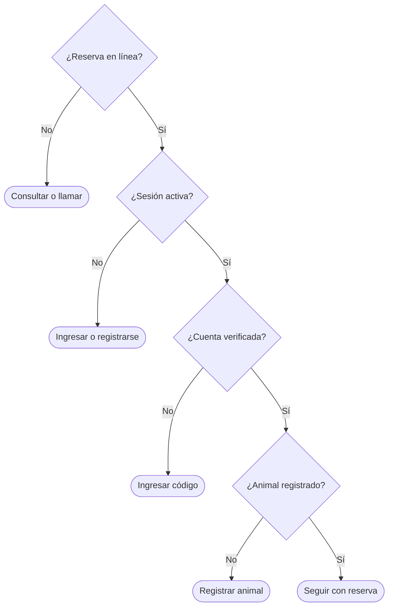

# Diagramas funcionales iniciales de escritorio

Fecha: 2026-10-09

Estado: borrador de análisis para revisar con Eric y Diego. No es diseño visual definitivo ni evidencia de RF implementados.

Estos diagramas son editables en Markdown/Mermaid y viajan con la rama `desktop`. Eric confirmó que el primer flujo será **catálogo público → registro → reservar turno** y que «árboles binarios» significa **decisiones de proceso con ramas Sí/No**, no un árbol de navegación ni una estructura de datos algorítmica.

## 1. Flujo: catálogo público → acceso → reserva

Fuentes: `CU-VIS-01`, `CU-VIS-03`, `CU-CLI-02`, [registro](../analisis/ESPECIFICACION_REGISTRO_CLIENTE.md) y [reserva/consulta](../analisis/FLUJO_RESERVA_CONSULTA.md). Trazabilidad principal: RF-VIS-01, RF-VIS-07, RF-CLI-02, RN-38 y RNF-USA-01. El servicio puede ser público sin reserva en línea; en ese caso se muestra «Consultar/llamar». Una acción protegida pide acceso y retoma la intención. Los cuatro pasos de reserva son animal, tipo/profesional, fecha/hora y revisión/confirmación.

```mermaid
flowchart LR
    inicio([Inicio]) --> catalogo[Catálogo público]
    catalogo --> servicio[Elegir servicio]
    servicio --> reservable{"¿Reserva en línea?"}
    reservable -->|No| consultar([Consultar o llamar])
    reservable -->|Sí| intentar[Intentar reservar]
    intentar --> sesion{"¿Sesión activa?"}
    sesion -->|No| acceso[Acceso o registro]
    sesion -->|Sí| verificada{"¿Cuenta verificada?"}
    acceso --> verificada
    verificada -->|No| codigo[Código por correo]
    verificada -->|Sí| retomar[Retomar intención]
    codigo --> retomar
    retomar --> animal{"¿Animal registrado?"}
    animal -->|No| alta[Registrar animal]
    animal -->|Sí| pasos[Cuatro pasos de reserva]
    alta --> pasos
    pasos --> disponibilidad[Revalidar disponibilidad]
    disponibilidad --> libre{"¿Horario disponible?"}
    libre -->|No| alternativo[Elegir otro horario]
    alternativo --> pasos
    libre -->|Sí| confirmado([Turno confirmado])
```

**Límite de la rama `desktop`:** la navegación, los formularios, mensajes y estados se podrán ensayar con datos de demostración una vez cerradas las especificaciones necesarias. El código enviado por correo, la cuenta verificada, la disponibilidad, la reserva y la persistencia reales pertenecen a la integración posterior con la API/MySQL. En el prototipo se marcarán como simulados y no se contabilizarán como RF cumplidos. Quedan pendientes los detalles P-RC-01/02 y D-REG-02/05 que Diego debe cerrar.

## 2. Árbol binario de decisiones: siguiente paso para reservar

Cada pregunta interna tiene exactamente dos ramas, **Sí** y **No**. Las hojas indican el siguiente paso, no una reserva ya creada. Después de iniciar sesión, verificar el correo o registrar un animal, se vuelve al flujo anterior y se revalida lo necesario. Esta representación no sustituye las reglas completas de agenda ni un algoritmo de búsqueda en una estructura de datos.

El árbol solo selecciona el **siguiente paso visible**. No concede permisos por sí solo: la futura API deberá validar sesión, cuenta verificada, responsabilidad sobre el animal y disponibilidad real. En la rama `desktop` esas respuestas serán demostrativas, sin guardar datos ni crear un turno verdadero. Diego debe cerrar las decisiones pendientes por recorrido y Eric/Codex revisarán el resultado.
